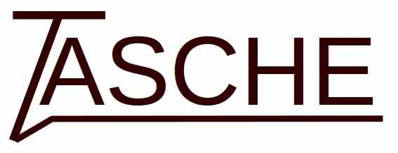

<p align="center"></p>

<h1 align="center">Text Adventure and Simple CHatbot Engine</h1>

<p align="center">

<a href="https://github.com/MiguelMJ/TASCHE/wiki"></a>
<a href="LICENSE"></a>

</p>
[Léeme en español :es:](README_ES.md) 

### Description
TASCHE is a tool for specifying text-based applications that seeks flexibility in the input recognition and response generation.
For a detailed guide see the [wiki](https://github.com/MiguelMJ/TASCHE/wiki) .

### Basic example

Given the specification file `example0.json` from below, this are two possible conversations.

| Conversation A | Conversation B |
| -------------- | -------------- |
| **Hello!**<br/>>hi<br/>**Hello there!**<br/>>My name is Miguel<br/>**nice to meet you, Miguel!**<br/>>My name is TASCHE<br/>**No way! That's my name too!** |**Hello!**<br/>>My name is TASCHE<br/>**That's my name too!**<br/>>My name is Roberto<br/>**I am confused, you said your name was TASCHE!**<br/>**nice to meet you, Roberto!**<br/>>My name is Jose<br/>**But you said your name was Roberto!**<br/>**Mine is TASCHE, nice to meet you, Jose!**|

_example0.json_

```JSON
{
"init":"Hello!\n",
"responses":[
    {
        "input":"(hello|hi)",
        "condition":"1",
        "output":"Hello[ there][!]"
    },{
        "input":"my name is >name",
        "condition":"1",
        "question":"$name",
        "responses":[
            {
                "input":"TASCHE",
                "condition":"1",
                "output":"[No way! ]''That's my name too!''{@known_name = @name}"
            },{
                "input":"$known_name",
                "condition":"1",
                "output":"I know! Its a (beautiful|cool) name."
            },{
                "condition":"@known_name",
                "output":"[([Now ]I am confused, |But )]you said your name was $known_name!"
            },{
                "condition":"1",
                "output":"[(Mine|My name|I am) is TASCHE, ]nice to meet you, $name!{@known_name = @name}"
            }]
    }]
}
```
### Build TASCHE

TASCHE has no dependencies, but to build it you must have Flex and Bison in your computer. To build the project use plain make:

```
cd /project/path
make
```

### To do

* [ ] Embed Lua to replace the expressions.

- [ ] Allow an edit distance in the input matching (Levenshtein Automata)
- [x] Debug the interaction between dynamic variables and omisible patterns (branch dynamic_and_omisibles).
- [ ] Implement more verbose and debug options.
- [ ] Module for knowledge bases.
- [ ] Extend documetation.
- [ ] Optimize the comparison algorithms (too many substr).
