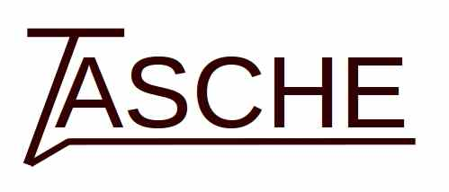

Text Adventure and Simple CHatbot Engine

***
Read [this document in english :gb::us:](README.md)

### Uso
Para una guía detallada de uso, ver la [wiki](https://github.com/MiguelMJ/TASCHE/wiki)

### Compilar TASCHE
TASCHE no tiene dependencias externas, pero para compilarlo hace falta disponer de Flex y Bison.

Para compilar el proyecto, make debería bastar:

```
cd /project/path
make
```

### Pendiente

* [ ] Integrar scripts de Lua para sustituir las expresiones

- [ ] Permitir una distancia de edit en el matching (autómata de Levenshtein)
- [x] Depurar la interacción entre variables dinámicas y patrones omisibles (branch dynamic_and_omisibles en marcha)
- [ ] Perfeccionar distintas opciones y niveles de verbose y debug
- [ ] Módulo para bases de conocimiento
- [ ] Extender la documentación.
- [ ] Optimizar los algoritmos de comparación (evitar el uso de substr)
